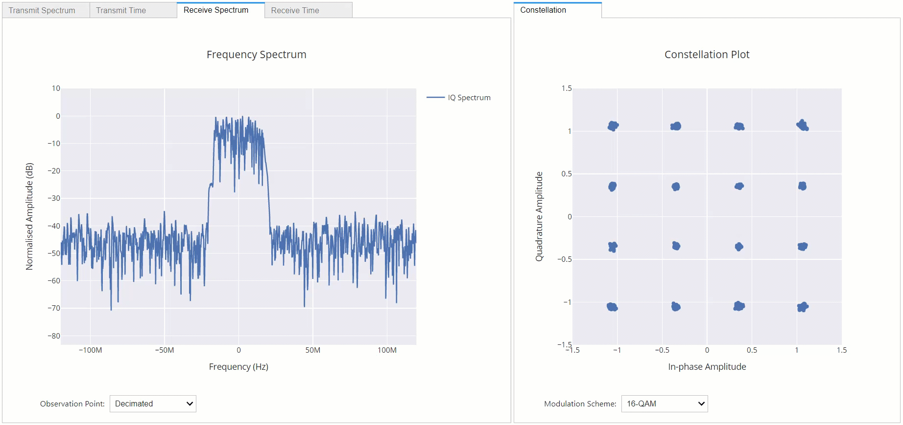

# RFSoC OFDM Transceiver
This repository contains an RFSoC demonstration of an Orthogonal Frequency Division Multiplexing (OFDM) transceiver. The OFDM system is only compatible with [PYNQ images v2.6 and greater](https://github.com/Xilinx/PYNQ/releases) for the [ZCU111](https://www.xilinx.com/products/boards-and-kits/zcu111.html) and the [RFSoC2x2](http://rfsoc-pynq.io/).

<p align="center">
  
<p/>

## Quick Start
Follow the instructions below to install the OFDM demonstrator on your development board. **You will need to give your board access to the internet**.
* Power on your RFSoC2x2 or ZCU111 development board with an SD Card containing a fresh PYNQ v2.6 image.
* Navigate to Jupyter Labs by opening a browser (preferably Chrome) and connecting to `http://<board_ip_address>:9090/lab`.
* We need to open a terminal in Jupyter Lab. Firstly, open a launcher window as shown in the figure below:

<p align="center">
  
<p/>

* Now open a terminal in Jupyter as illustrated below:

<p align="center">
  
<p/>

* Now execute the following command in the terminal:

```sh
pip3 install git+https://github.com/strath-sdr/rfsoc_ofdm
```

The notebook should now be available in the `ofdm-demonstrator` folder in your Jupyter Workspace.
It is important that you use the Chrome web browser if possible as rendering performance is important.

Follow the remaining steps below for your development board to finish setting up the demonstration.

## RFSoC2x2 Setup
During package installation, a 384MHz clock description file will be added to the xrfclk package. This is used by the demonstration to create a 384MHz clock for RF DC PLLs.

This repository uses Voila to create simple web applications using Jupyter notebooks. Your RFSoC2x2 development board should already be preinstalled with a version of Voila and no further setup is required.

## ZCU111 Setup
We need to add a 384 MHz clock to the xrfclk package. We can simply overwrite __init__.py, with the changes.
```sh
mkdir /home/xilinx/GitHub
cd /home/xilinx/GitHub/
git clone https://github.com/dnorthcote/ZCU111-PYNQ
cd /home/xilinx/GitHub/ZCU111-PYNQ
cp /home/xilinx/GitHub/ZCU111-PYNQ/ZCU111/packages/xrfclk/pkg/xrfclk/__init__.py /usr/local/lib/python3.6/dist-packages/xrfclk/__init__.py
```

This repository uses Voila to create simple web applications using Jupyter notebooks. If you would like to use Voila (completely optional) on your ZCU111 development board, simply follow the instructions outlined in this [blog post](https://strath-sdr.github.io/pynq/linux/zynq/fpga/voila/2021/02/22/install-voila-on-pynq-v2-6.html).

## Using the Project Files
The following software is required to use the project files in this repository.
- Vivado Design Suite 2020.1
- System Generator for DSP
- MATLAB R2020a

### Vivado
This project can be built with Vivado from the command line. Open Vivado 2020.1 and execute the following into the tcl console:
```sh
cd /<repository-location>/boards/<board-name>/rfsoc_ofdm/
make project
make block_design
make bitstream_file
```

Alternatively, you can run the entire project build by executing the following into the tcl console:
```sh
make all
```

## License
[BSD 3-Clause](/LICENSE)
